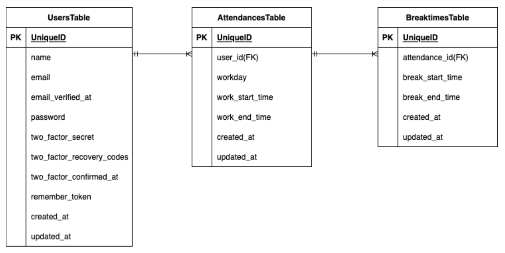

# Atte

## アプリケーションの目的と概要
人事評価を目的とした社員の勤怠を管理するためのシステム

##　アプリケーションURL

## 機能一覧
・ 会員登録、ログイン、ログアウト（Laravelの認証機能を利用）

・ 勤務開始、勤務終了（勤務終了時に日を跨いでいたら2日分の勤務として記録）

・ 休憩開始、休憩終了（1日に何度でも休憩可能）

・ 日付別勤怠情報取得、ページネーション（5件ずつ取得）

## 使用技術（実行環境）
      

## テーブル設計

## ER図

## 環境構築
### 言語・フレームワーク：バージョン

PHP : 7.4.9

Laravel : 8.83.27

nginx : 1.21.1

MySQL : 8.0.26

### コマンド
githubクローンURL : git@github.com:hirokam/Atte_dev.git

リポジトリの紐付け先変更 : git remote set-url origin 作成したリポジトリのurl

dockerコンテナの生成と起動 : docker-compose up -d --build

PHPコンテナのコマンド操作 : docker-compose exec php bash

キー生成 : php artisan key:generate

### 環境変数
MYSQL_ROOT_PASSWORD : root

MYSQL_DATABASE : laravel_db

MYSQL_USER : laravel_user

MYSQL_PASSWORD : laravel_pass

## その他
### テストアカウント
1.鈴木一郎

メールアドレス : i.suzuki@example.com

パスワード : 12345678

---

2.鈴木花子

メールアドレス : h.suzuki@example.com

パスワード : 12345678

----------------------------------------

3.鈴木二郎

メールアドレス : j.suzuki@example.com

パスワード : 12345678

----------------------------------------

4.鈴木三郎

メールアドレス : s.suzuki@example.com

パスワード : 12345678

----------------------------------------

5.鈴木四郎

メールアドレス : si.suzuki@example.com

パスワード : 12345678

----------------------------------------

6.鈴木五郎

メールアドレス : g.suzuki@example.com

パスワード : 12345678
